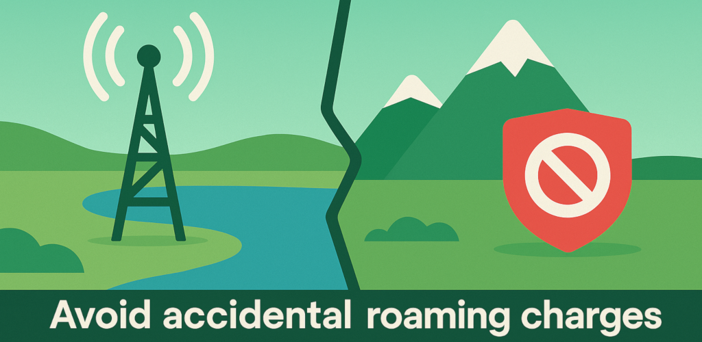
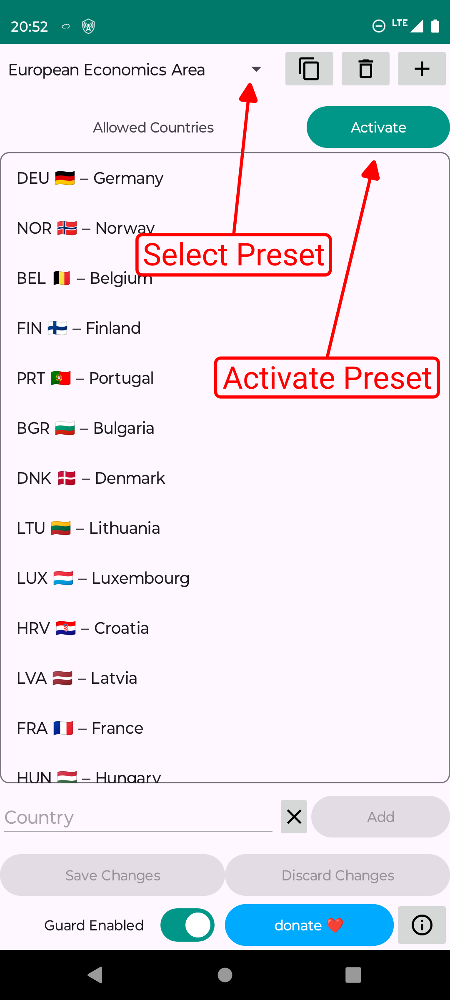
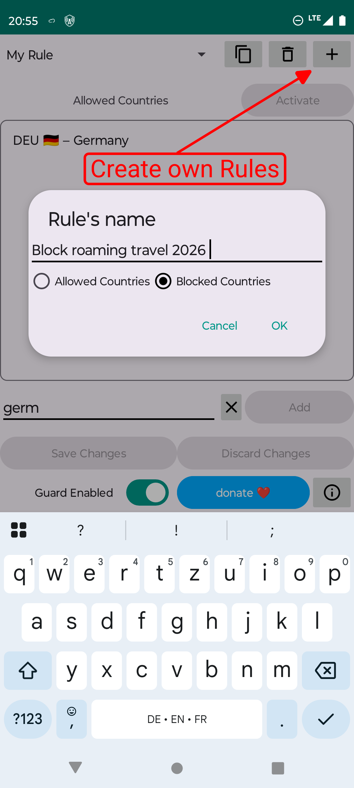
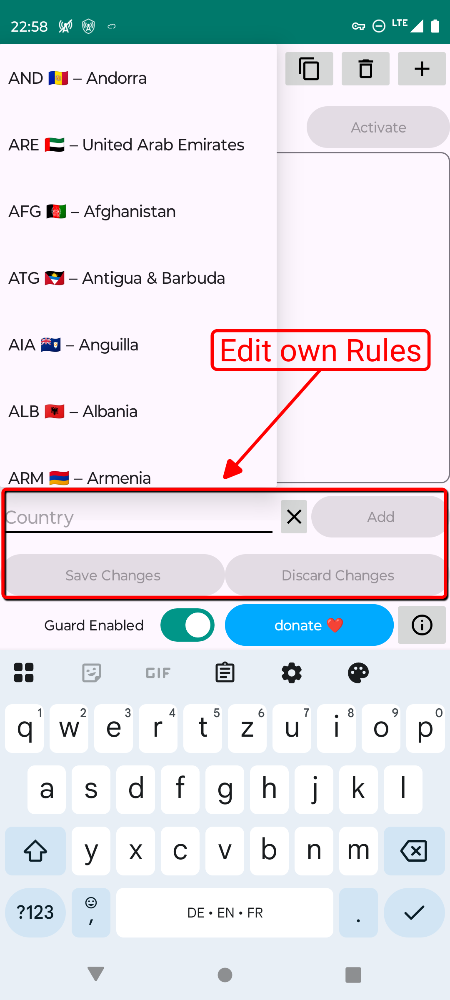
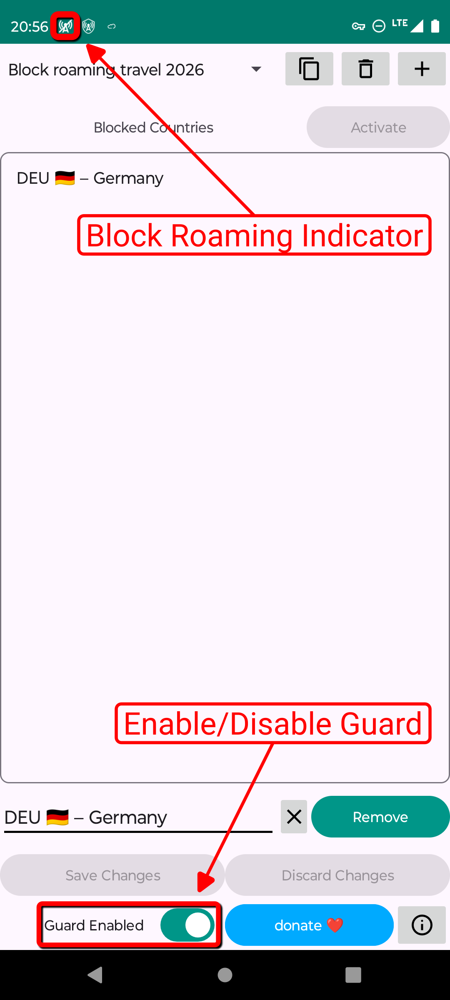

# Roaming Borders

Stay in control of your mobile connection and avoid accidental roaming fees—automatically.

  

## Why this app?

When you travel near country borders, your phone may automatically connect to a stronger cell tower across the border, even if you never left your country. This can result in costly roaming fees.

Manually toggling roaming is inconvenient and easy to forget.  
**Roaming Borders** automates the guardrails so you don’t have to.

## What it does

- **Block roaming when you don’t want it**  
  Select allowed countries; if your device connects outside that list, data traffic is blocked.
- **Avoid surprise charges**  
  Prevent accidental cross-border roaming near national frontiers.
- **Simple presets or full control**  
  Choose ready-made country presets or build your own list for upcoming trips.
- **On-device only**  
  Uses Android’s `VpnService` as a local firewall. No tunneling to servers.

## How it works

Roaming Borders runs a lightweight, **on-device VPN** that filters traffic based on your current country.
- When your current country **is not** in your allow-list → **block** data traffic system-wide.
- When your current country **is** allowed → **allow** traffic as normal.
- When connected to **Wi-Fi**, the guard **pauses automatically** and **resumes** once Wi-Fi disconnects.

> **Note on reboot:** After restarting your phone, the guard re-enables after a short delay. To be extra safe, enable *Airplane mode* before restarting.

## Screenshots

  
  
  
  

## Installation

1. Download the latest APK from **Releases**.
2. Install and open the app.
3. Follow the tutorial screenshots above, i.e., select your allowed countries and activate the rule.
> The app shows a persistent notification while protection is active (required by Android for VPN/foreground services). You can disable notifications manually.

## Privacy

- **No data collection.**  
  The app does **not** collect, store, or share personal information.
- **Minimal processing.**  
  The only data processed is the **current country** of your connection, used locally to decide whether to allow or block traffic.

## Contributing

Issues and pull requests are welcome! If you’re proposing a larger change, please open an issue first to discuss what you’d like to build.

## Donate

If this app saves you time or roaming fees, consider supporting development:  
👉 **[Donate](https://donate.stripe.com/6oU6oHcEpaXzab41m5bII00)**

## License

This project is licensed under **GPLv3**. See [LICENSE](LICENSE) for details.

---

**Trademarks**: Android is a trademark of Google LLC. This project is not affiliated with Google or any carrier.
